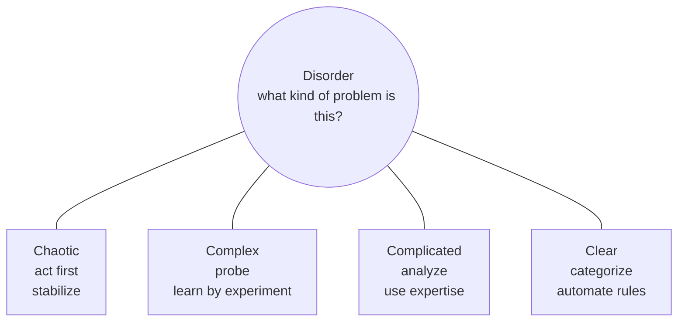

  
Nova Knowledge | 15 min setup + live demo

  <h1>From PM to AI Builder</h1>
  
Deploy your first agent with Anthropic

  
Andres Santos Sanz | Applied AI Lead at Bit2Me | ex-Revolut

<!--
Set the contract immediately: the talk is short and practical. Theory is only here to make the demo easier to understand.
-->

---

# What I want to cover before the demo

  
01<strong>Why pilots fail</strong><small>The 95% problem</small>

  
02<strong>How to diagnose</strong><small>Cynefin + water cycle</small>

  
03<strong>Why now</strong><small>Services + managed platforms</small>

  
04<strong>Demo structure</strong><small>Claude Managed Agents</small>

The goal is to get to the demo quickly. The framework is just the map.

<!--
Keep this under one minute. It tells the audience that this will not be a long theory lecture.
-->

---
class: dark
---

  
MIT / NANDA, State of AI in Business 2025

  <h1>95%</h1>
  <h2>of GenAI pilots showed no visible return</h2>
  
That is not only a model problem. It is a deployment, workflow, and complexity problem.

<!--
Do not spend time defending the exact number. Use it as the starting tension: demos are easy, deployed impact is hard.
-->

---

# My lens on this problem

  

    <strong>Now</strong>
    Applied AI Lead at Bit2Me
    <small>Agents, apps, workflows, and internal tools with domain experts.</small>
  

  

    <strong>Before</strong>
    Revolut, Amazon, industrial operations
    <small>Growth analytics, CX operations, logistics, process improvement.</small>
  

  

    <strong>Pattern</strong>
    AI succeeds when it closes a loop
    <small>Observe, act, inspect, correct, and improve the workflow.</small>
  

I am not approaching agents as research. I am approaching them as operating systems for teams.

---
class: framed
---

# Diagnose before building

Most failed agent projects start by choosing tools before diagnosing the problem shape.

---
layout: center
class: water
---

# The water-cycle analogy

  
<b>Chaotic</b>Rain as mystery

  
<b>Complex</b>Patterns observed

  
<b>Complicated</b>Hydrology + meteorology

  
<b>Clear</b>Primary-school science

The phenomenon did not change. Our model of it changed.

<!--
Use the "chamanes" example carefully: the point is not to mock early explanations, but to show how knowledge moves problems across domains.
-->

---

# Agents are moving domains too

Early agents were difficult because every layer was separate:

- weaker models;
- brittle tools;
- ad hoc memory;
- custom orchestration;
- fragile evals;
- unclear deployment path.

Concept reference: Anthropic, "Building effective agents" - augmented LLM.

<!--
This image comes from the Anthropic reference. Use it to show that an agent is already a system, not a chat box.
-->

---
class: split-dark
---

# Two ways the market is reducing complexity

  

    Path 1
    <h2>Expert deployment</h2>
    
OpenAI and Anthropic are moving closer to implementation because enterprise AI is contextual.

    <small>Think: specialists working inside the workflow.</small>
  

  

    Path 2
    <h2>Managed platforms</h2>
    
Managed agent stacks collapse model, environment, tools, sessions, and events into one surface.

    <small>Think: fewer moving parts for builders.</small>
  

---

# What changes with managed agents

Claude Managed Agents lets us talk about a full execution loop:

  
<b>Agent</b>role, instructions, boundaries

  
<b>Environment</b>where work happens

  
<b>Session</b>the running loop

  
<b>Events</b>observable progress

  
<b>Output</b>reviewable artifact

Concept reference: Anthropic, autonomous agent loop.

---
class: demo-map
---

# Demo structure

  
1<b>Create</b><small>agent + instructions</small>

  
2<b>Run</b><small>session + events</small>

  
3<b>Inspect</b><small>tools + memo</small>

  
4<b>Improve</b><small>constraints + output</small>

  <h2>Investment committee simulator</h2>
  
Educational analysis only. No personal financial advice. No buy/sell/hold recommendation.

<!--
This is the last theory slide. After this, switch to terminal/browser demo.
-->

---

  <strong>Reference mental model</strong>
  Coding agents work because they can close the loop against ground truth: edit, run, test, inspect, fix.

---
layout: section
class: demo-section
---

# Live demo

## Claude Managed Agents

Create -> Run -> Inspect -> Improve

---

# What PMs should watch for

  
<b>Scope</b>What job does the agent own?

  
<b>Boundaries</b>What is it forbidden to do?

  
<b>Evidence</b>Where does context enter?

  
<b>Observability</b>Can we inspect the loop?

  
<b>Output</b>Can a human review it?

  
<b>Iteration</b>What do we improve next?

---

# Steering the workshop

  
<b>Ship first</b>Keep the build linear: agent, environment, session, events, output.

  
<b>Then harden</b>Ask what changes before this becomes production: confirmations, outcomes, evals, monitoring.

  
<b>Decompose</b>Move responsibilities into tools, skills, or subagents instead of growing one large prompt.

The room should leave with a product habit: inspect the loop before trusting the agent.

<!--
Use the Anthropic workshops as the backbone: Ship Your First Managed Agent for the linear build, Production-ready Agent for deployment concerns, and Agent Decomposition for the "tool, skill, or subagent?" discussion.
-->

---

# Fallback if the live demo fails

1. Show the agent contract.
2. Show the expected event stream.
3. Show the generated memo.
4. Ask the room to critique the output.
5. Improve the instruction live.

A demo failure is still a product lesson: robust systems need visible loops and fallback paths.

---

# Final takeaway

  <h2>Do not start with "we need an agent."</h2>
  
Start with the loop: what repetitive, judgment-heavy, reviewable workflow can the agent improve?

  Diagnose
  Constrain
  Run
  Inspect
  Improve

---

# References

  <a href="https://www.artificialintelligence-news.com/wp-content/uploads/2025/08/ai_report_2025.pdf">MIT/NANDA - The GenAI Divide</a>
  <a href="https://cynefin.io/index.php/Cynefin">Cynefin framework</a>
  <a href="https://www.anthropic.com/engineering/building-effective-agents">Anthropic - Building effective agents</a>
  <a href="https://www.anthropic.com/news/enterprise-ai-services-company">Anthropic - Enterprise AI services company</a>
  <a href="https://openai.com/index/openai-launches-the-deployment-company/">OpenAI - Deployment Company</a>
  <a href="https://platform.claude.com/docs/en/agents-and-tools/managed-agents/overview">Claude Managed Agents</a>
  <a href="https://youtu.be/19HDQ9HppOA">Claude - Ship your first Managed Agent</a>
  <a href="https://youtu.be/jWWsLe4Gh5Y">Claude - Production-ready agent</a>
  <a href="https://youtu.be/mWvtOHlZM-I">Claude - Tool, skill, or subagent?</a>
  <a href="https://github.com/anthropics/cwc-workshops/tree/main">Anthropic - Code with Claude workshops</a>

