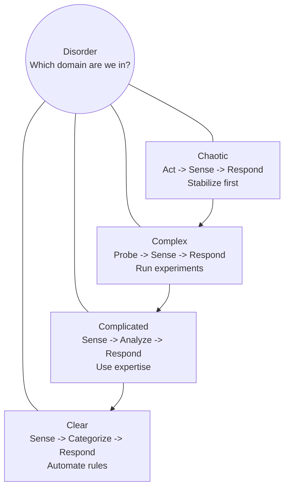
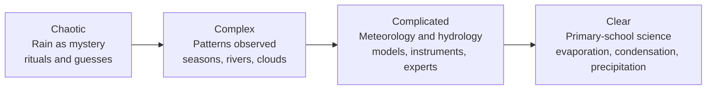
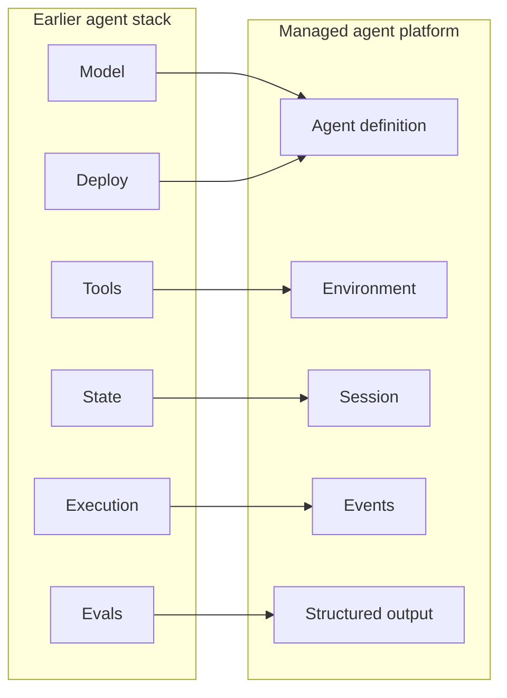
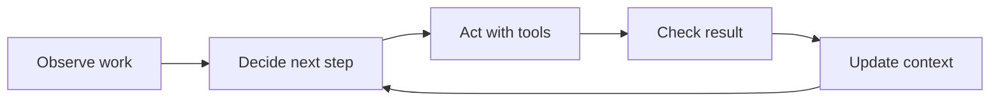
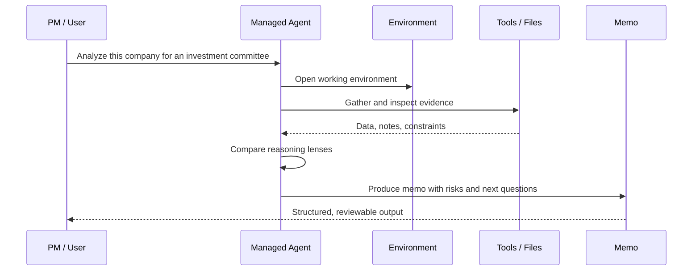
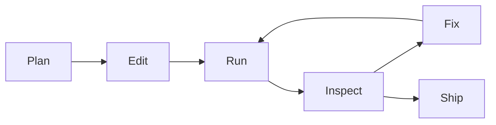
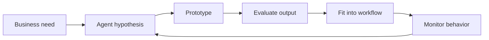

# From PM to AI Builder

## Deploy your first agent with Anthropic

Andres Santos Sanz  
Applied AI Lead at Bit2Me | ex-Revolut

<!--
Open with the practical promise: this is not a hype talk and not a coding tutorial. It is a product-thinking session about when agents are worth building and how the stack is becoming simple enough for PMs to reason about.
-->

---
layout: section
---

# The uncomfortable starting point

---

# 95% of GenAI pilots show no visible return

The 2025 MIT/NANDA report made the industry problem explicit: most enterprise GenAI pilots were not translating into measurable business impact.

That is not only a technology problem.

It is a **problem-shape** problem.

<!--
Do not over-litigate the statistic. Use it as the hook: many pilots do not become useful systems. The point is to explain why and what changed.
-->

---

# Why pilots stall

| Failure mode | What it looks like |
| --- | --- |
| Wrong problem shape | Treating complex work like a simple automation |
| No workflow integration | The demo works, the business process does not change |
| Weak specialization | One generic assistant for many incompatible jobs |
| No closed loop | The system cannot observe, correct, and improve |
| Fragmented stack | Models, tools, memory, evals, and deployment all live separately |

<!--
This slide sets up the rest of the talk. Each later section addresses one failure mode.
-->

---
layout: section
---

# Diagnose before you build

---

# Cynefin for AI opportunities

The mistake is building an agent before knowing which domain the work belongs to.

<!--
Use "clear" instead of "simple" when referencing modern Cynefin language, but mention that many people know the older "simple" label.
-->

---

# The water-cycle analogy

Knowledge moves domains over time.

What was once mysterious becomes teachable when the system is observed, modeled, and simplified.

<!--
Use the shaman story carefully: not to mock early explanations, but to show how problem domains evolve as knowledge accumulates.
-->

---

# Agents are going through the same shift

Early agent work often felt chaotic:

- models were weaker;
- tools were brittle;
- memory was ad hoc;
- evals were separate;
- deployment was custom;
- the agent was not specialized enough.

Now the ecosystem is moving agent work from **complex** toward **complicated** and sometimes **clear**.

---
layout: section
---

# Two responses from the market

---

# Response 1: expert deployment services

OpenAI and Anthropic are both moving closer to implementation and enterprise deployment work.

The signal is clear:

> In large organizations, the hardest part is not prompting. It is translating messy business work into reliable AI systems.

This is consulting-like because the complexity is contextual.

<!--
Reference OpenAI Deployment Company and Anthropic enterprise AI services in the research notes. Keep this slide high-level unless there is time.
-->

---

# Response 2: managed agent platforms

The second response is productization: make the stack smaller.

The PM question becomes: can we describe the job, the tools, the environment, and the acceptance criteria?

---

# Today's demo path

Claude Managed Agents gives us a way to explain the full loop:

- define an agent;
- give it an environment;
- start a session;
- stream events while it works;
- inspect tool use and output;
- repeat with better instructions and constraints.

This is not just a model call. It is a managed execution loop.

---
layout: section
---

# Who is building this?

---

# My working context

I build practical AI systems with operational teams:

- agents;
- apps;
- workflows;
- internal tools.

At Bit2Me, my role is to co-create solutions with domain experts so teams can move faster.

Before that: Revolut growth analytics and CX operations, Amazon logistics, and industrial operations.

<!--
Keep it fast. The goal is credibility, not a CV walkthrough.
-->

---

# The pattern I keep seeing

The best AI projects are not "AI projects."

They are operational improvements where AI closes a loop:

The tool is new. The operating principle is not.

---
layout: section
---

# Demo: investment committee simulator

---

# Demo framing

We will build an educational analysis agent that simulates an investment committee.

It will:

- collect a company and analysis goal;
- research or process provided inputs;
- reason through multiple lenses;
- produce a structured investment memo;
- state uncertainty and missing evidence.

It will not provide personalized financial advice or buy/sell recommendations.

---

# What we want the agent to do

---

# What PMs should watch for

Not the syntax.

Watch for:

- how the job is scoped;
- what the agent is allowed to do;
- where the evidence comes from;
- how uncertainty is represented;
- how the output can be reviewed;
- how the next iteration becomes obvious.

---
layout: section
---

# The closed-loop advantage

---

# Coding agents change the build loop

The productivity jump comes when the coding agent can close the loop itself:

plan, modify, execute, inspect, and correct.

---

# The PM version of the same loop

If there is no loop, there is no product.

---

# A practical checklist

Before building an agent, answer:

1. What job will this agent own?
2. What tools and data does it need?
3. What decisions can it make?
4. What must a human approve?
5. What does a good output look like?
6. How will we know it improved the workflow?

---
layout: section
---

# Closing

---

# The takeaway

The path from PM to AI builder is not about becoming a full-time engineer.

It is about learning to:

- diagnose the problem shape;
- simplify the agent stack;
- define constraints and outputs;
- build with closed loops.

When the loop closes, teams move faster.

---

# Questions

What part of your current workflow is stuck between a demo and a deployed system?

<!--
Use this question to prompt audience examples. If time is short, point them to the handout checklist.
-->
